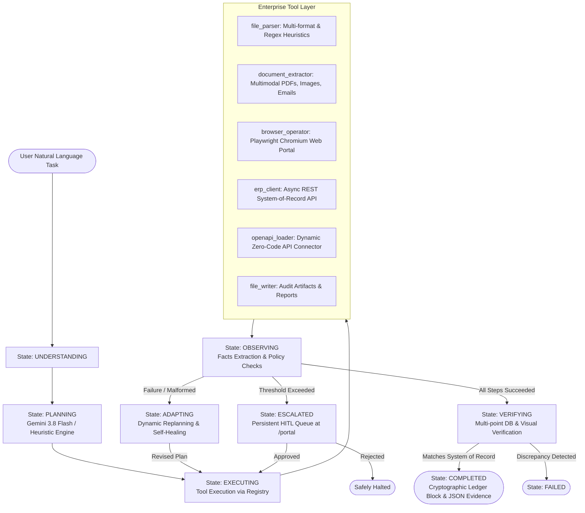

# 🤖 Autonomous AI Task Worker — CentrAlign AI (Enterprise Edition)

[](https://www.python.org/)
[](https://fastapi.tiangolo.com/)
[](https://playwright.dev/)
[](https://ai.google.dev/)
[]()
[]()

An enterprise-ready **Autonomous AI Task Worker / Company Operator** that takes natural language company instructions and autonomously completes them using tool orchestration, browser UI automation, multimodal document ingestion, closed-loop state verification, self-correcting error recovery, human-in-the-loop governance, and tamper-evident cryptographic audit logs.

---

## 📌 Executive Summary

Enterprise knowledge work frequently involves navigating disconnected tools, parsing semi-structured documents, inputting data into internal CRM/ERP portals, and verifying whether actions succeeded.

Rather than relying on brittle scripts or opaque wrappers, this software implements an **autonomous agent loop** that:
1. **Decomposes natural language goals** into atomic actions without micro-management.
2. **Operates across computers & browsers**: Controls headless Chromium via Playwright, async REST APIs, files, and dynamic OpenAPI integrations.
3. **Multimodal Document Understanding**: Ingests PDFs, scanned images, raw vendor emails (`.eml`), and structured JSON/CSV.
4. **Self-Healing & Autonomous Adaptation**: Detects broken formats or missing data, self-corrects using heuristic fallbacks, and repairs changed UI selectors.
5. **Human-in-the-Loop Governance**: Pauses high-risk actions ($10,000 spend limit), registers approval requests in a persistent web queue (`/portal`), and safely resumes upon human sign-off.
6. **Deterministic System-of-Record Verification**: Queries database state directly after write operations to prove mutations occurred rather than hallucinating success.
7. **Production Enterprise Hardening**: Enforces SHA-256 hash-chained immutable audit ledgers, runtime secret redaction vaults, durable background job workers, and containerized deployment.

---

## 🏗️ Architecture & State Machine

The core loop strictly enforces the lifecycle:  
**Goal ➔ Understand ➔ Plan ➔ Execute ➔ Observe ➔ Adapt (Self-Correct) ➔ Verify (State Check) ➔ Complete (Evidence & Cryptographic Block)**



### State Lifecycle Definitions

| State | Purpose |
|---|---|
| `IDLE` | Agent standby, awaiting task assignment. |
| `UNDERSTANDING` | Parses high-level intent, extracts targets, initializes working memory. |
| `PLANNING` | Generates ordered sequence of steps with dynamic variable placeholders (`{{placeholder}}`). |
| `EXECUTING` | Binds discovered memory facts and invokes the corresponding registered tool. |
| `OBSERVING` | Evaluates tool outputs, extracts discovered facts, checks governance spend thresholds. |
| `ADAPTING` | Triggered upon failure; replans alternative strategies and self-heals corrupted inputs. |
| `ESCALATED` | Suspends execution into `logs/suspended_tasks/` and notifies operators via the `/portal` approval queue. |
| `VERIFYING` | Performs independent read-back query against ERP to mathematically prove database mutation. |
| `COMPLETED` | Generates execution log, records cryptographic SHA-256 block, and outputs execution timing metrics. |
| `FAILED` | Maximum retries exhausted or action rejected by human supervisor. |

---

## 🌐 Web Operator Portal & Approval Queue

The system includes an interactive web interface served at:  
👉 **`http://127.0.0.1:8000/portal`**

Features:
- **Live Accounts Payable Ledger**: Real-time table showing all processed vendor invoices, status, due dates, and amounts.
- **Direct Portal Entry Form**: Allows human operators or browser automation agents (`browser_operator.py`) to enter invoices via modal forms.
- **Asynchronous Human-in-the-Loop Approval Queue**: When the agent encounters high-risk actions (e.g. invoices > $10,000), the task is suspended and displayed in the queue with **Approve** and **Reject** buttons.
- **Real-time Status Badge**: Instant feedback on pending tasks and automated reconciliations.

---

## 🚀 Quick Start

### 1. Prerequisites
- Python 3.10, 3.11, 3.12, or 3.13
- Git
- Playwright Chromium (`playwright install chromium`)

### 2. Installation
```bash
# Clone the repository
git clone https://github.com/Rishitgoel/CenterAlignAi.git
cd CenterAlignAi

# Install dependencies
pip install -r requirements.txt

# Install Playwright browser
playwright install chromium

# Copy environment template
cp .env.example .env
```

*(Optional)* Add your Google Gemini API key to `.env` to enable LLM-driven planning:
```ini
GEMINI_API_KEY="your_api_key_here"
```
> **Note**: If no API key is provided, the agent automatically falls back to its deterministic planning heuristics, ensuring 100% offline functionality.

### 3. Running the Server & Web Portal
In Terminal 1, start the FastAPI Mock ERP and Portal:
```bash
python run_server.py
```
Open **`http://127.0.0.1:8000/portal`** in your browser.

### 4. Running the Autonomous AI Worker
In Terminal 2, dispatch natural language requests:

```bash
# 1. Standard Happy Path (JSON file)
python main.py "Process the invoice from demo/invoices/invoice_globex_002.json into our ERP system."

# 2. Browser Web Portal Automation (Playwright fills the web portal form)
python main.py "Open the company web portal and submit the invoice for Stark Industries, invoice INV-WEB-770, amount 4200.00, due 2026-11-15."

# 3. Multimodal PDF Ingestion
python main.py "Process the PDF invoice at demo/invoices/invoice_cyberdyne_005.pdf into the ERP system."

# 4. Self-Healing from Malformed File
python main.py "Process invoice demo/invoices/invoice_malformed_003.json into the ERP system."

# 5. Governance Escalation (> $10,000 spend limit)
python main.py "Process invoice demo/invoices/invoice_highvalue_004.json into our ERP system."
```

### 5. Running the Background Worker Queue
To run the durable background job worker:
```bash
python -m infrastructure.worker
```

### 6. Running the Synthetic Benchmark Suite
Evaluate system autonomy, self-healing rates, and audit chain integrity:
```bash
python -m benchmarks.eval_suite
```

---

## 🧪 Automated Test Suite

Run all 9 automated scenarios:
```bash
pytest tests/ -v
```

Test Scenarios Covered:
1. `test_scenario_1_happy_path`: Standard end-to-end invoice processing and verification.
2. `test_scenario_2_error_recovery`: Autonomous recovery from malformed syntax using regex heuristics.
3. `test_scenario_3_human_escalation_detection`: Governance threshold detection for high-value spend ($75,000).
4. `test_scenario_4_browser_ui_automation`: Headless Chromium navigation, table extraction, and screenshot evidence.
5. `test_scenario_5_multimodal_document_ingestion`: PDF and email invoice parsing with confidence scoring.
6. `test_scenario_6_dynamic_openapi_synthesis`: Zero-code dynamic tool generation from arbitrary OpenAPI schemas.
7. `test_scenario_7_cryptographic_audit_ledger`: SHA-256 hash-chain verification and tamper detection.
8. `test_scenario_8_credential_vault_redaction`: Masking of API tokens and passwords in prompt contexts and logs.
9. `test_scenario_9_worker_service_job_queue`: Asynchronous task submission, job state persistence, and worker retrieval.

---

## 🐳 Docker Deployment

Run the complete multi-service stack with Docker Compose:

```bash
# Build and run web portal and background worker
docker-compose up --build
```
- Web Portal: `http://localhost:8000/portal`
- API Documentation: `http://localhost:8000/docs`
- Background Task Worker: Running continuously in `centralign-task-worker`

---

## 📂 Project Structure

```text
CenterAlignAi/
├── agent/                         # Core Autonomous Agent Engine
│   ├── core.py                    # Main agent execution loop & state transitions
│   ├── executor.py                # Parameter binding and tool execution
│   ├── hitl_manager.py            # Asynchronous HITL task suspension & web queue
│   ├── memory.py                  # Working memory & facts store
│   ├── models.py                  # Pydantic state models & schemas
│   ├── observer.py                # Output inspection & governance policy checks
│   ├── planner.py                 # Gemini 3.8 Flash & heuristic planning
│   ├── self_healing.py            # Semantic UI selector fallback resolver
│   └── verifier.py                # Multi-point state verification against ERP
│
├── benchmarks/                    # Synthetic Evaluation Benchmark
│   └── eval_suite.py              # Autonomy & self-healing benchmark runner
│
├── infrastructure/                # Distributed Execution & Queue
│   └── worker.py                  # Durable task job runner & background worker
│
├── security/                      # Enterprise Compliance & Hardening
│   ├── audit_ledger.py            # SHA-256 hash-chained immutable audit ledger
│   └── credential_vault.py        # Token redaction filter & secret manager
│
├── mock_erp/                      # Simulated Company ERP Environment
│   ├── app.py                     # FastAPI REST API & HITL approval endpoints
│   ├── database.py                # Asynchronous SQLite persistence
│   ├── models.py                  # Invoice & vendor data models
│   └── static/
│       └── portal.html            # Web Portal UI with Accounts Payable & HITL queue
│
├── tools/                         # Modular Tool Ecosystem
│   ├── base.py                    # Base tool interface
│   ├── browser_operator.py        # Playwright Chromium browser automation
│   ├── document_extractor.py      # Multimodal PDF, image, and eml parsing
│   ├── erp_client.py              # Async HTTP client for ERP system
│   ├── file_parser.py             # Structured document parser & regex heuristic
│   ├── file_writer.py             # Audit trail and completion report writer
│   ├── openapi_loader.py          # Dynamic OpenAPI/Swagger tool synthesizer
│   └── registry.py                # Central tool registry
│
├── demo/invoices/                 # Realistic test fixture documents
│   ├── invoice_acme_001.json       # Clean JSON invoice ($1,500)
│   ├── invoice_globex_002.json     # Multi-item invoice ($3,250.75)
│   ├── invoice_malformed_003.json  # Malformed syntax for recovery demo
│   ├── invoice_highvalue_004.json  # High-value invoice ($75,000) for escalation
│   ├── invoice_cyberdyne_005.pdf   # Scanned PDF invoice fixture ($4,800)
│   └── invoice_vendor_email_006.eml# Raw vendor email invoice fixture ($890)
│
├── Dockerfile                     # Production container with Playwright & Python 3.11
├── docker-compose.yml             # Orchestration for portal and worker services
├── requirements.txt               # Pinned dependencies
├── run_server.py                  # ERP server launcher
└── tests/
    └── test_scenarios.py          # 9 automated end-to-end test scenarios
```

---

## 🔒 Security, Compliance & Governance

- **Tamper-Evident Merkle-Chain**: Every state transition, tool execution, and verification result is hashed with SHA-256 into `logs/compliance_audit_ledger.jsonl`. Altering any past block breaks the hash chain, immediately detected by `verify_ledger_integrity()`.
- **Sensitive Data Redaction**: The `CredentialVault` automatically scrubs API tokens, Bearer strings, and passwords before any prompt is dispatched to an LLM or persisted to JSON logs.
- **Deterministic Spend Gates**: High-value transactions cannot be triggered without human approval, backed by persistent task checkpoints that survive system restarts.

---

## 🛠️ Tech Stack & Dependencies

- **Language**: Python 3.10+
- **LLM**: Google Gemini 3.8 Flash via official `google-genai` SDK
- **Browser Automation**: Playwright (Chromium)
- **Backend & Web**: FastAPI, Uvicorn, httpx, HTML5/Tailwind CSS
- **Database**: SQLite with `aiosqlite`
- **Security & Integrity**: SHA-256 Hash Chaining, Pydantic v2
- **Testing**: Pytest, AsyncIO

---

## 💡 Important Technical & Design Decisions

1. **Explicit Hierarchical State Machine vs. Unconstrained ReAct Loops**:
   - *Decision*: Rather than letting an LLM loop freely without boundaries, we built an explicit 8-state machine (`IDLE` ➔ `UNDERSTANDING` ➔ `PLANNING` ➔ `EXECUTING` ➔ `OBSERVING` ➔ `ADAPTING` ➔ `VERIFYING` ➔ `COMPLETED`).
   - *Rationale*: Enterprise tasks require predictable guardrails, clear step transitions, deterministic retry budgets, and precise compliance auditing. An explicit state machine prevents hallucinated infinite loops and enables auditable enterprise governance.

2. **The "Query-Back" Verification Pattern (Zero-Trust Validation)**:
   - *Decision*: The agent never assumes success simply because an API call returned HTTP 200 or an LLM said "I did it". Instead, the `Verifier` independently queries the ERP database (`GET /invoices/{id}`), asserts field-level mathematical and string equality, and checks disk report existence and DOM screenshot proof.
   - *Rationale*: Hallucinated success is the #1 failure mode of autonomous agents in production. Query-Back verification ensures verifiable ground truth before closing any task.

3. **Dual-Mode Planning & Resilient Fallbacks**:
   - *Decision*: Google Gemini Flash plans the task dynamically. However, if the API key is missing, network is offline, or quota is exhausted (429), the planner seamlessly falls back within 5 seconds to a deterministic heuristic engine.
   - *Rationale*: Business-critical automation cannot grind to a halt because of external API latency or cloud outages. The worker is 100% functional both online and fully air-gapped.

4. **Persistent Asynchronous Human-in-the-Loop Governance**:
   - *Decision*: When high-risk thresholds are exceeded (invoices > $10,000), execution doesn't abort or block an active worker thread. It serializes the task state to disk (`logs/suspended_tasks/`), pushes an approval ticket to the live Web Operator Portal (`/portal`), and safely resumes once approved.
   - *Rationale*: Real enterprise employees don't hold synchronous command prompts open for hours waiting for manager approval. Asynchronous queue suspension mirrors real-world corporate workflows.

5. **Runtime Zero-Code OpenAPI Tool Synthesizer**:
   - *Decision*: Ingests arbitrary OpenAPI v3 / Swagger schemas at runtime (`tools/openapi_loader.py`) and dynamically binds them into callable tools with schema validation.
   - *Rationale*: Maximizes generalization. The agent can adapt to any new microservice or third-party CRM without requiring custom Python wrappers.

6. **Cryptographic SHA-256 Merkle-Chained Audit Ledger**:
   - *Decision*: Every state transition, tool execution, human decision, and verification check is hashed with SHA-256 into an append-only JSONL ledger where each block points to the previous block's hash.
   - *Rationale*: Delivers tamper-evident SOC2 / ISO 27001 regulatory compliance. Any manual alteration of past execution records is mathematically detected by `verify_ledger_integrity()`.

---

## ⚠️ Known Limitations

1. **Single-Node Task Queue**: Current job suspension and worker scheduling uses disk-backed JSON file persistence (`logs/suspended_tasks/` and `logs/jobs/`) rather than a distributed broker like Redis, RabbitMQ, or Temporal.
2. **DOM-Level Web Interaction**: Browser automation uses Playwright for web apps with standard HTML DOM elements, modals, and forms. It does not currently use low-level OS mouse/keyboard coordinate models for non-web desktop applications (e.g. legacy Windows desktop ERPs).
3. **Free-Tier Gemini API Quota**: When running under free Gemini API tiers with strict RPM/RPD limits, extended bursts can trigger 429 rate limits. The system handles this gracefully via an async 5-second timeout and instant heuristic fallback.
4. **Document Extraction Layouts**: Highly irregular, un-templated physical paper scans with severe tilt or noise rely on Gemini's multimodal vision model; very complex multi-page tables may require dedicated OCR pipelines.

---

## 🔮 What We Would Build Next (Future Roadmap)

If given additional time, our immediate roadmap includes:
1. **OS-Level Computer Use & Native Desktop Automation**:
   - Integrate multimodal screen capture + mouse coordinate action models (e.g. Anthropic / Gemini Computer Use APIs) to navigate legacy native desktop ERP software (SAP GUI, Oracle Desktop) alongside web applications.
2. **Temporal.io / Distributed Orchestration Engine**:
   - Upgrade the current background worker into a durable distributed state machine using Temporal.io or Celery + Redis, enabling multi-machine execution, automatic checkpoint recovery across node crashes, and multi-tenant worker pools.
3. **Cross-Session Memory & Vendor Vector Knowledge Base**:
   - Implement long-term vector memory (ChromaDB / pgvector) to store vendor-specific nuances discovered over time (e.g., "Vendor X puts their tax ID in the notes field" or "Vendor Y's invoices always arrive under a different company name").
4. **Interactive Natural Language Operator Collaboration**:
   - Enhance the Web Portal HITL Queue with an interactive chat window allowing human operators to give mid-flight corrections or clarifying instructions to suspended tasks (e.g., "This invoice has a 10% discount, apply it before submitting").

---

## 📐 Assumptions Made While Building

1. **Simulated Corporate System-of-Record**: We assumed an internal company ERP/CRM accessible via both modern REST API endpoints and a web browser portal (`http://127.0.0.1:8000/portal`).
2. **Financial Spend Risk Threshold**: We assumed any financial commitment over $10,000 represents critical operational risk that requires dual-control human authorization.
3. **Input Imperfection**: We assumed real enterprise invoices arrive in messy, heterogeneous formats (corrupted JSON, raw vendor email threads, scanned PDFs) and that autonomous workers must handle syntax defects without human intervention.
4. **Zero-Dependency Resilience**: We assumed production agents must never hard-crash if external cloud LLM APIs experience downtime; local deterministic fallback logic is mandatory.

---

## 📦 Models, APIs, Frameworks & Pre-Built Components

| Component | Technology | Role & Purpose |
|---|---|---|
| **Language Model** | Google Gemini 3.8 Flash / 2.5 Flash | High-level goal decomposition, multimodal PDF analysis, dynamic replanning |
| **LLM SDK** | `google-genai` (v1.0+) | Official Google GenAI SDK for async model interaction |
| **Browser Automation** | Playwright Chromium | Headless browser execution, web portal automation, screenshot proof |
| **Mock ERP Backend** | FastAPI + Uvicorn | High-performance asynchronous REST API & Web Operator Portal |
| **Database** | SQLite + `aiosqlite` | Asynchronous local database simulating company system-of-record |
| **Data Validation** | Pydantic v2 & Pydantic-Settings | Strict typing for action plans, execution logs, and audit blocks |
| **HTTP Client** | `httpx` | Async HTTP client for REST ERP interactions and health checks |
| **PDF Extraction** | `pypdf` | Local text extraction fallback for PDF documents |
| **CLI & UI** | Rich (`Console`, `Table`, `Panel`) | Real-time terminal state visualization, logs, and plan rendering |
| **Audit Ledger** | Python `hashlib` (SHA-256) | Merkle-chained immutable cryptographic audit ledger |
| **Containerization** | Docker & Docker Compose | Multi-container deployment for ERP portal and background worker |

---

## 🎥 Demo Video & Walkthrough

- **Recorded Walkthrough**: [Link to Demo Video (YouTube / Loom) — *To be added by candidate*]
- **Demo Script**: Follow the complete 2m45s narration script in [`docs/DEMO_SCRIPT.md`](docs/DEMO_SCRIPT.md).

---

## 📄 License

MIT License. Developed for CentrAlign AI.
