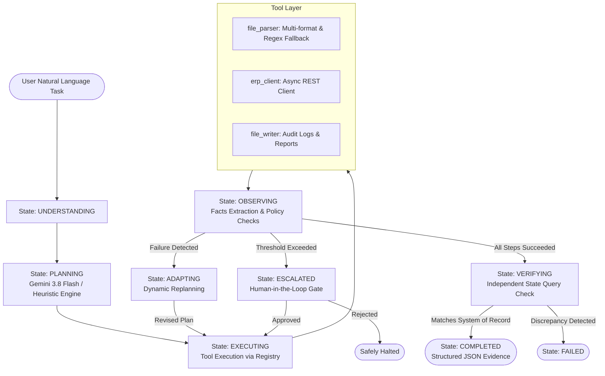

# 🤖 Autonomous AI Task Worker — CentrAlign AI Prototype

[](https://www.python.org/)
[](https://fastapi.tiangolo.com/)
[](https://ai.google.dev/)
[](https://opensource.org/licenses/MIT)

An enterprise-ready prototype of an **Autonomous AI Task Worker / Company Operator** that takes natural language company instructions and autonomously completes them using tool orchestration, closed-loop state verification, self-correcting error recovery, and human-in-the-loop escalation.

---

## 📌 Executive Summary

Enterprise knowledge work frequently involves navigating disconnected tools, parsing unstructured or semi-structured files, inputting data into internal CRM/ERP systems, and verifying whether actions succeeded. 

Rather than relying on brittle scripts or hardcoded automation, this prototype implements a **goal-driven autonomous agent** that:
1. **Decomposes natural language goals** into atomic tool steps without micro-management.
2. **Executes across realistic environments** (local files, async REST APIs, persistent SQLite storage).
3. **Inspects tool outputs and adapts** to failures (e.g. malformed syntax) by replanning fallback strategies.
4. **Enforces governance safety thresholds** by escalating high-value spend to humans.
5. **Deterministically verifies system-of-record state** after execution rather than hallucinating success.
6. **Produces immutable structured JSON evidence trails** capturing every transition and API response.

---

## 🏗️ Architecture & State Machine

The core loop strictly enforces the lifecycle:  
**Goal ➔ Understand ➔ Plan ➔ Execute ➔ Observe ➔ Adapt (Self-Correct) ➔ Verify (State Check) ➔ Complete (Evidence)**



### State Definitions

| State | Purpose |
|---|---|
| `IDLE` | Agent standby, awaiting task assignment. |
| `UNDERSTANDING` | Parses high-level intent, extracts targets, initializes working memory. |
| `PLANNING` | Generates ordered sequence of steps with dynamic variables (`{{placeholder}}`). |
| `EXECUTING` | Binds discovered memory facts and calls corresponding tool. |
| `OBSERVING` | Evaluates tool output, extracts new state facts, checks policy rules. |
| `ADAPTING` | Triggered upon failure; initiates replanner for self-correction. |
| `ESCALATED` | Pauses for human confirmation before proceeding with high-stakes actions. |
| `VERIFYING` | Performs independent read-back query against ERP to prove database mutation. |
| `COMPLETED` | Generates execution log, evidence diffs, and execution timing metrics. |
| `FAILED` | Maximum retries exhausted or policy violation rejected by human. |

---

## 🚀 Quick Start

### 1. Prerequisites
- Python 3.10, 3.11, 3.12, or 3.13
- Git

### 2. Installation
```bash
# Clone the repository
git clone https://github.com/Rishitgoel/CenterAlignAi.git
cd CenterAlignAi

# Install dependencies
pip install -r requirements.txt

# Copy environment template
cp .env.example .env
```

*(Optional)* Add your Google Gemini API key to `.env` to enable LLM-driven planning:
```ini
GEMINI_API_KEY="your_api_key_here"
```
> **Note**: If no API key is provided, the agent automatically falls back to its deterministic planning heuristics, ensuring 100% offline functionality.

### 3. Start the Mock Enterprise ERP Server
In Terminal 1, start the local mock ERP backend:
```bash
python main.py server
```
Server runs at `http://127.0.0.1:8000` with Swagger docs available at `http://127.0.0.1:8000/docs`.

### 4. Run the Autonomous Worker
In Terminal 2, run any enterprise task:
```bash
python main.py run --task "Find the latest invoice from Acme Corp in demo/invoices/invoice_acme_001.json, extract the details, enter it into our ERP system, and verify completion."
```

---

## 🎬 4 Core Benchmark Scenarios

The prototype ships with pre-configured demo invoices in `demo/invoices/`:

### Scenario 1: Happy Path Autonomous Execution
```bash
python main.py run --task "Find the latest invoice from Acme Corp in demo/invoices/invoice_acme_001.json, extract the details, enter it into our ERP system, and verify completion."
```
- **What Happens**: The agent extracts data from `invoice_acme_001.json`, formats the ERP payload, POSTs to `/invoices`, writes a summary report, and executes a read-back query (`GET /invoices/{id}`) to prove the data was recorded properly.

### Scenario 2: Autonomous Error Recovery (Self-Correction)
```bash
python main.py run --task "Process the invoice from demo/invoices/invoice_malformed_003.json and record it into our ERP system."
```
- **What Happens**: `invoice_malformed_003.json` contains invalid syntax without quotes. The JSON parser throws `JSONDecodeError`. The observer detects this failure, transitions to `ADAPTING`, triggers the replanner, switches to text-regex extraction, recovers the data (`Initech`, `$2,100.50`), and successfully records the invoice.

### Scenario 3: Human-in-the-Loop Governance Escalation
```bash
python main.py run --task "Process the high-value vendor invoice from demo/invoices/invoice_highvalue_004.json into our ERP system."
```
- **What Happens**: `invoice_highvalue_004.json` is for **$75,000.00**, exceeding the configured `$10,000.00` autonomous threshold. The agent transitions to `ESCALATED`, halts execution, presents the context to the human operator, and asks for approval before touching the ERP.

### Scenario 4: Duplicate Invoice Prevention
Run Scenario 1 twice in succession:
- **What Happens**: The ERP returns `409 Conflict` (duplicate invoice for vendor). The agent catches the conflict error, adapts, prevents double-spending, and logs the incident.

---

## 📁 Repository Structure

```
CenterAlignAi/
├── README.md                      # Comprehensive project documentation
├── requirements.txt               # Pinned project dependencies
├── config.py                      # Pydantic Settings management (.env)
├── main.py                        # Unified CLI entrypoint (run / server)
│
├── agent/                         # Autonomous Core Engine
│   ├── __init__.py
│   ├── core.py                    # Main agent loop & state machine orchestrator
│   ├── models.py                  # Pydantic schemas (AgentState, Steps, Logs)
│   ├── memory.py                  # Working memory & context summarization
│   ├── planner.py                 # Gemini 3.8 Flash planner with heuristic fallback
│   ├── executor.py                # Tool executor & variable interpolation
│   ├── observer.py                # Step observer & governance escalation check
│   └── verifier.py                # Deterministic read-back verification engine
│
├── tools/                         # Modular Tool Layer
│   ├── __init__.py                # Tool registry factory
│   ├── base.py                    # Abstract Tool & ToolResult classes
│   ├── registry.py                # Tool registry & dynamic prompt generator
│   ├── file_parser.py             # Multi-format invoice parser + regex fallback
│   ├── erp_client.py              # Async HTTP client for ERP/CRM endpoints
│   └── file_writer.py             # File and audit report writer
│
├── mock_erp/                      # Simulated Company Internal System
│   ├── __init__.py
│   ├── app.py                     # FastAPI REST API (CRUD + Duplicate rejection)
│   ├── database.py                # Async SQLite database layer (aiosqlite)
│   └── models.py                  # ERP Pydantic models (Invoice, LineItem, Vendor)
│
├── demo/
│   ├── invoices/                  # Demo invoice fixtures
│   │   ├── invoice_acme_001.json       # Clean JSON invoice ($1,500)
│   │   ├── invoice_globex_002.json     # Multi-item invoice ($3,250.75)
│   │   ├── invoice_malformed_003.json  # Malformed syntax for recovery demo
│   │   └── invoice_highvalue_004.json  # High-value invoice ($75,000) for escalation
│   └── scenarios.json             # Benchmark definitions
│
├── docs/
│   ├── ARCHITECTURE.md            # In-depth architectural & state machine deep dive
│   └── DEMO_SCRIPT.md             # 2-minute video presentation script
│
├── logs/                          # Auto-generated structured JSON execution traces
└── tests/
    ├── __init__.py
    └── test_scenarios.py          # Automated scenario test suite
```

---

## 💡 Important Design Decisions & Trade-Offs

1. **Lightweight Agent Loop over Heavy Frameworks**:
   - *Decision*: We built the state machine and agent loop directly in pure Python rather than using LangChain or AutoGen.
   - *Rationale*: Eliminates leaky framework abstractions, guarantees deterministic state control, and makes every transition, retry, and verification step inspectable.

2. **Query-Back Verification vs. Hallucinated Success**:
   - *Decision*: The verifier executes an independent `GET` request directly to the database after write operations to compare fields.
   - *Rationale*: LLMs frequently report success simply because a tool returned without raising an exception. Deterministic state verification proves the mutation occurred in the system of record.

3. **Deterministic Governance Rules for Human-in-the-Loop**:
   - *Decision*: Spend threshold evaluation is executed in deterministic Python code inside `Observer` rather than delegated to prompt instructions.
   - *Rationale*: Financial controls and authorization limits must be 100% deterministic and immune to prompt injection or model nondeterminism.

4. **Dual Planning (Gemini 3.8 Flash + Resilient Heuristic Fallback)**:
   - *Decision*: The planner queries Google's latest `gemini-3.8-flash` model via the `google-genai` SDK, but maintains a heuristic planner fallback.
   - *Rationale*: Guarantees the system operates cleanly during live demos even under offline conditions or API quota exhaustion.

---

## 🔍 Verification & Evidence Sample

Every execution outputs a timestamped audit artifact in `logs/task_<id>.json`. Example extract:

```json
{
  "task_id": "task_20261004_054432_fc59b8",
  "original_request": "Find the latest invoice from Acme Corp in demo/invoices/invoice_acme_001.json...",
  "final_state": "COMPLETED",
  "total_duration_ms": 714.66,
  "steps_executed": [
    {
      "step_id": 1,
      "tool_name": "file_parser",
      "action": "Parse invoice document",
      "success": true,
      "duration_ms": 1.2
    },
    {
      "step_id": 2,
      "tool_name": "erp_client",
      "action": "Enter extracted invoice details into internal ERP system",
      "success": true,
      "duration_ms": 14.8
    }
  ],
  "evidence": {
    "erp_record": {
      "id": 3,
      "vendor_name": "Acme Corp",
      "invoice_number": "INV-2024-001",
      "amount": 1500.0,
      "status": "pending",
      "created_at": "2026-10-04T05:44:32.557425"
    }
  }
}
```

---

## ⚠️ Known Limitations

1. **Document Modalities**: Currently supports JSON, CSV, and text-based invoice formats. Scanned PDFs and raster images would require OCR or direct multimodal vision processing.
2. **Synchronous Step Sequencing**: Steps within a plan run sequentially. Parallel execution of independent steps (e.g. parsing 5 invoices simultaneously) is not yet supported.
3. **Single Human Channel**: Human escalation prompts are currently delivered via the interactive terminal CLI (`Confirm.ask`). Production deployment would dispatch to Slack, Teams, or an approval webhook.

---

## 🔮 What We Would Build Next (Future Roadmap)

1. **Browser & UI Automation (Playwright)**: Add a `browser_operator` tool allowing the agent to navigate web ERPs (e.g., NetSuite, QuickBooks) using semantic accessibility snapshots.
2. **Multimodal Document Processing**: Integrate Gemini 3.8 Flash multimodal understanding to natively ingest handwritten receipts and PDF invoices without pre-parsing.
3. **Approval Webhooks & Asynchronous Resumption**: Support webhook callbacks so long-running approvals can pause the agent in persistent storage and resume when an executive approves via email or Slack.
4. **Autonomous Synthetic Evaluation Benchmarks**: Build a benchmark suite that generates hundreds of perturbed invoice edge cases to calculate autonomous completion rates.

---

## 🛠️ Tech Stack & Dependencies

- **Language**: Python 3.10+
- **LLM**: Google Gemini 3.8 Flash via `google-genai` SDK
- **Backend**: FastAPI, Uvicorn, httpx
- **Database**: SQLite with `aiosqlite`
- **Schemas & Config**: Pydantic v2, Pydantic-Settings
- **Terminal UI**: Rich
