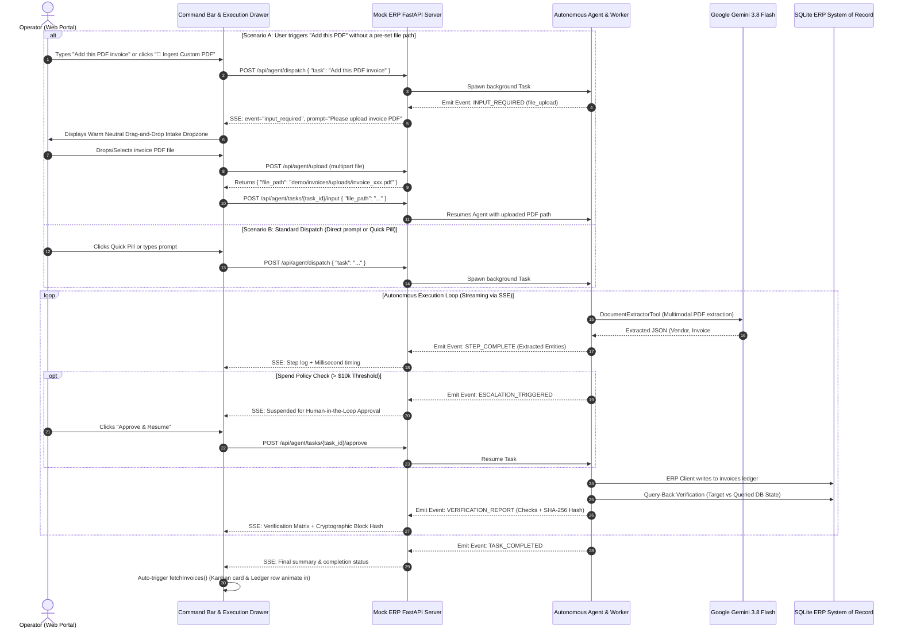

# 🚀 In-App AI Worker Command Center: Implementation Plan
> **CentrAlign Enterprise Operations Portal** — Interactive In-Software AI Worker Command Center with Real-Time Streaming, Dynamic Document Intake, Zero-Trust Verification, and Human-in-the-Loop Governance.

---

## 📌 Executive Objective
Transform the CentrAlign Enterprise Web Portal (`http://127.0.0.1:8000/portal`) from a passive view-and-approve dashboard into a **fully interactive, in-software AI Operations Center**.

Users will be able to:
1. Type natural language instructions directly into a modern Command Bar at the top of the portal.
2. Click 1-click preset scenario pills for instant demo execution.
3. Trigger interactive **on-demand PDF document intake** (drag-and-drop file upload) whenever the agent prompts for an invoice.
4. Watch live, step-by-step agent progress (CentrAlign 5-Stage Stepper: `INGEST` ➔ `EXTRACT` ➔ `POLICY CHECK` ➔ `MUTATE ERP` ➔ `VERIFY`) in a live streaming execution drawer.
5. Review independent Query-Back verification proofs and cryptographic SHA-256 hash badges.
6. Resolve High-Value Spend escalations ($10,000+ threshold) with one-click inline Human-in-the-Loop (HITL) approval buttons.
7. See the live Accounts Payable ledger and Opportunity Kanban boards automatically update in real time with zero page refresh.

---

## 🏛️ System Architecture & Data Flow



---

## 🎨 Design System & Aesthetic Foundation

All UI elements strictly adhere to the **CentrAlign AI / 21st-CRM Design System** specified in `mock_erp/static/theme.css` and `design.md`:

| Design Dimension | Token / Value | Application in AI Command Center |
|---|---|---|
| **Typography** | `var(--font-sans)`: Google Sans<br>`var(--font-mono)`: JetBrains Mono | Headings, buttons, labels, and prompts use Google Sans. Dollar amounts, invoice codes, SHA-256 hashes, task IDs, and durations use JetBrains Mono. |
| **Surfaces & Canvas** | Canvas: `#ffffff`<br>Sidebar: `#faf9f6`<br>Card: `#ffffff`<br>Hover: `#fbfaf7` | The AI Command Bar and Slide-over Drawer use warm neutral surfaces matching the existing layout. |
| **Borders & Radii** | Borders: `#e5e2da`, `#eae6de`<br>Radii: `--radius-card: 12px`, `--radius-inner: 8px` | Subtle 1px neutral framing. No heavy borders or harsh box-shadows. |
| **Warm Accent** | `--brand-accent: #b45309`<br>`--brand-accent-subtle: #fef3c7` | Visual stepper active rings, input focus outlines, and HITL alert callouts. |
| **Muted Badges** | Sage: `#f2f7f4` (text `#2f523e`)<br>Clay: `#faf4f4` (text `#5c3535`)<br>Pill: `#f4f4f5` | Status pills, tool badges (`document_extractor`), and verification match markers. |
| **Drawer Layout** | Slide-over panel (`w-full sm:w-[480px] lg:w-[540px]`) | Right-anchored drawer allows operators to watch background Kanban board and Ledger react live. |

---

## 📋 Phase-by-Phase Technical Roadmap

### Phase 1: Backend Dispatch, Streaming Engine & Event Hook
- **File**: `agent/core.py`
  - Add an optional asynchronous event hook to `Agent`:
    ```python
    on_event: Optional[Callable[[Dict[str, Any]], Awaitable[None]]] = None
    ```
  - When `on_event` is provided, emit structured payloads:
    - `STATE_CHANGE`: `{"from_state": str, "to_state": str}`
    - `PLAN_CREATED`: `{"goal": str, "steps": List[Dict]}`
    - `STEP_START`: `{"step_number": int, "tool_name": str, "description": str}`
    - `STEP_COMPLETE`: `{"step_number": int, "success": bool, "duration_ms": float, "summary": str}`
    - `INPUT_REQUIRED`: `{"input_type": "file_upload", "prompt": str, "allowed_extensions": List[str]}`
    - `ESCALATION_TRIGGERED`: `{"question": str, "reason": str, "threshold": float, "amount": float}`
    - `VERIFICATION_REPORT`: `{"passed": bool, "checks": List[Dict], "block_hash": str}`
    - `TASK_COMPLETED`: `{"summary": str, "duration_ms": float}`
    - `TASK_FAILED`: `{"error": str}`
  - Ensure 100% backward compatibility: when `on_event=None`, CLI executions (`python main.py run ...`) operate without changes.
  - Implement task suspension bridge with `asyncio.Event` allowing the worker to await user input or approval without thread blocking.

- **File**: `mock_erp/app.py`
  - Maintain an in-memory execution registry:
    ```python
    active_tasks: Dict[str, TaskExecutionState] = {}
    ```
  - Implement `POST /api/agent/dispatch`:
    - Request: `{"task": str, "file_path": Optional[str]}`
    - Response: `{"task_id": str, "status": "STARTED"}`
    - Spawns background task via `asyncio.create_task`.
  - Implement `GET /api/agent/tasks/{task_id}/events`:
    - Server-Sent Events (SSE) `text/event-stream` delivering real-time execution events.
  - Implement `POST /api/agent/tasks/{task_id}/approve`:
    - Resolves pending HITL escalation and resumes task execution.
  - Implement `POST /api/agent/tasks/{task_id}/reject`:
    - Halts task execution with audit record.

---

### Phase 2: Dynamic PDF Intake Protocol & File Upload Engine
- **File**: `mock_erp/app.py`
  - Implement `POST /api/agent/upload`:
    - Accepts `UploadFile` (multipart/form-data).
    - Validates file extension (`.pdf`, `.png`, `.jpg`, `.jpeg`, `.json`, `.eml`).
    - Saves uploaded file to `demo/invoices/uploads/` with timestamped filename.
    - Returns `{"file_path": str, "filename": str, "size_bytes": int}`.
  - Implement `POST /api/agent/tasks/{task_id}/input`:
    - Request: `{"file_path": str}`
    - Delivers uploaded file path to the suspended agent task and unblocks `asyncio.Event`.

- **File**: `agent/planner.py` & `agent/core.py`
  - **Dynamic Intake Detection**:
    - If the user's task prompt specifies adding or processing a PDF (e.g., *"Add this PDF"*, *"Ingest invoice PDF"*, *"Upload this PDF invoice"*) without referencing an existing file on disk:
    - The agent enters `AgentState.AWAITING_INPUT`.
    - Emits an `INPUT_REQUIRED` event:
      ```json
      {
        "event": "INPUT_REQUIRED",
        "task_id": "task_2026...",
        "input_type": "file_upload",
        "prompt": "Please drop or attach the PDF invoice you would like CentrAlign AI to ingest and process.",
        "allowed_extensions": [".pdf", ".png", ".jpg", ".json"]
      }
      ```
    - Upon receiving the uploaded file path from `/api/agent/tasks/{task_id}/input`, sets `file_path` in working memory and proceeds directly to planning and multimodal extraction using `DocumentExtractorTool` (Gemini 3.8 Flash).

---

### Phase 3: In-Portal AI Command Bar & Demo Scenario Pills
- **File**: `mock_erp/static/portal.html`
  - Insert the **AI Command Bar** below the toolbar:
    - Container with `--bg-card`, `--border-card`, `--radius-card`, and subtle shadow.
    - Input element:
      `Ask CentrAlign AI Worker (e.g. 'Process Globex invoice' or 'Add this PDF')...`
    - Right-hand controls:
      - **"📎" Attachment button**: Allows operator to pre-attach a PDF file directly in the Command Bar.
      - **"🚀 Dispatch Worker" button**: High-contrast action button (`bg-gray-900 hover:bg-black text-white px-3.5 py-1.5 rounded-md text-xs font-semibold`).
      - Keyboard shortcut indicator: `<kbd class="font-mono text-[9px] bg-stone-100 border border-stone-200 px-1 py-0.5 rounded">Enter ↵</kbd>`.
  - Add **5 Curated Demo Scenario Pills**:
    1. **⚡ Process Clean Invoice**: `"Process invoice demo/invoices/invoice_globex_002.json into the ERP system."`
    2. **⚡ Multimodal PDF Ingestion**: `"Process the PDF invoice at demo/invoices/invoice_cyberdyne_005.pdf into the ERP system."`
    3. **⚡ Self-Heal Malformed File**: `"Process invoice demo/invoices/invoice_malformed_003.json into the ERP system."`
    4. **⚡ High-Value Escalation ($75k)**: `"Process invoice demo/invoices/invoice_highvalue_004.json into our ERP system."`
    5. **📄 Ingest Custom PDF (Interactive Upload)**: `"Add this PDF invoice into our ERP system."` *(Prompts the user for a PDF and ingests it on demand)*.
  - Clicking any pill populates the input and auto-dispatches the worker.

---

### Phase 4: Live Execution Drawer & 5-Stage CentrAlign Workflow Bar
- **File**: `mock_erp/static/portal.html`
  - Add a **Slide-over Drawer** (`#ai-drawer`, fixed right edge, `w-full sm:w-[480px] lg:w-[540px]`, `border-l border-[#e5e2da]`, smooth translate transition):
    - **Header**:
      - Task ID badge in JetBrains Mono.
      - Goal summary.
      - Pulsing state indicator (`● PLANNING`, `● EXECUTING`, `● VERIFYING`).
      - Drawer collapse button (`✕`).
    - **5-Stage Visual Workflow Stepper** (matching the CentrAlign signature workflow in `design.md`):
      `1. Ingest ➔ 2. Extract ➔ 3. Policy Check ➔ 4. Mutate ERP ➔ 5. Verify`
      - Pending: Muted gray ring.
      - Active: Pulsing amber ring (`--brand-accent`).
      - Completed: Sage green check ring (`--stage-won-ring`).
    - **Interactive Intake Dropzone** (rendered dynamically when `INPUT_REQUIRED` event arrives):
      - Warm dashed border in `--border-card-hover` (`#cfcabb`), background `--bg-card-hover` (`#fbfaf7`).
      - Visual file icon and prompt: *"Drag & drop your invoice PDF here, or click to browse"*.
      - File size and name preview upon selection.
      - Auto-uploads to `/api/agent/upload` ➔ feeds `/api/agent/tasks/{task_id}/input` ➔ agent auto-resumes without extra clicks.
    - **Step Stream Feed**:
      - Step cards with tool badge (`document_extractor`, `erp_client`), description, duration in milliseconds, and collapsible JSON entity preview.

---

### Phase 5: Zero-Trust Verification Matrix, Cryptographic Badges & In-App HITL
- **File**: `mock_erp/static/portal.html`
  - **Query-Back Verification Matrix**:
    - When the worker transitions to `VERIFYING`, render the verification table:
      - Fields checked (`Vendor Name`, `Invoice #`, `Amount`, `Status`).
      - Expected value vs. Actual value queried directly from the SQLite database.
      - Status badge: Sage green `MATCH (PASS)`.
  - **Cryptographic Provenance Badge**:
    - SHA-256 block hash badge from `security/audit_ledger.py`.
    - One-click copy with feedback tooltip.
  - **In-Drawer HITL Governance Panel**:
    - If spend > $10,000 threshold, display an amber warning card:
      *"⚠️ Task Suspended: High-Value Spend ($XX,XXX) exceeds policy threshold"*.
    - Inline dual action buttons:
      - **"Approve & Resume"** (`bg-gray-900 hover:bg-black text-white px-3 py-1.5 rounded-md text-xs font-semibold`).
      - **"Reject"** (`bg-white hover:bg-red-50 text-red-700 border border-red-200 px-3 py-1.5 rounded-md text-xs font-semibold`).
    - Clicking sends decision to `/api/agent/tasks/{task_id}/approve` or `/reject`.
  - **Reactive Live Workspace Refresh**:
    - Upon `TASK_COMPLETED`, call `fetchInvoices()` automatically.
    - The new invoice appears immediately in the Accounts Payable table and Opportunity Kanban board with a smooth highlight animation.

---

### Phase 6: Automated Testing & Verification
- **File**: `tests/test_scenarios.py`
  - Add `test_scenario_10_in_app_dispatch_and_streaming`:
    - Dispatches a task via `POST /api/agent/dispatch`.
    - Reads the SSE stream from `GET /api/agent/tasks/{task_id}/events`.
    - Verifies arrival of `STATE_CHANGE`, `STEP_COMPLETE`, `VERIFICATION_REPORT`, and `TASK_COMPLETED`.
  - Add `test_scenario_11_dynamic_pdf_upload_and_ingestion`:
    - Dispatches prompt `"Add this PDF invoice"`.
    - Receives `INPUT_REQUIRED` event.
    - Uploads `demo/invoices/invoice_cyberdyne_005.pdf` via `POST /api/agent/upload`.
    - Submits file path to `POST /api/agent/tasks/{task_id}/input`.
    - Verifies completion and database entry in SQLite.
  - Add `test_scenario_12_in_app_hitl_approval`:
    - Dispatches high-value invoice ($75,000).
    - Verifies task suspension and `ESCALATION_TRIGGERED` event.
    - Calls `POST /api/agent/tasks/{task_id}/approve`.
    - Verifies task resumes and completes successfully.
  - **Backward Compatibility Check**:
    - Run `pytest tests/test_scenarios.py` to confirm all 12 test scenarios pass with zero regressions.

---

## ⏱️ Execution Timeline

| Step | Scope | Estimated Time | Key Deliverable |
|---|---|---|---|
| **Phase 1** | Backend `on_event` hook in `agent/core.py`, task registry, dispatch endpoint & SSE stream in `mock_erp/app.py` | 25 mins | Asynchronous task dispatcher + live SSE stream |
| **Phase 2** | `POST /api/agent/upload`, `POST /api/agent/tasks/{task_id}/input`, dynamic intake logic | 20 mins | Dynamic PDF upload and ingestion protocol |
| **Phase 3** | AI Command Bar, 5 Quick Scenario Pills, and attachment button in `mock_erp/static/portal.html` | 20 mins | Enterprise Command Bar & Scenario Pills |
| **Phase 4** | Slide-over drawer, 5-stage CentrAlign workflow bar, and interactive intake dropzone | 25 mins | Responsive streaming execution drawer |
| **Phase 5** | Query-Back verification table, SHA-256 hash badge, in-drawer HITL approval buttons, and reactive ledger refresh | 20 mins | Verification matrix, HITL buttons & auto-refresh |
| **Phase 6** | Automated test scenarios (10, 11, 12 in `tests/test_scenarios.py`) and full regression verification | 15 mins | Pytest verification & CLI compatibility guarantee |
| **Total** | **Complete In-App AI Command Center with Dynamic PDF Ingestion** | **~2 hrs 05 mins** | Production-ready In-App AI Command Center |
